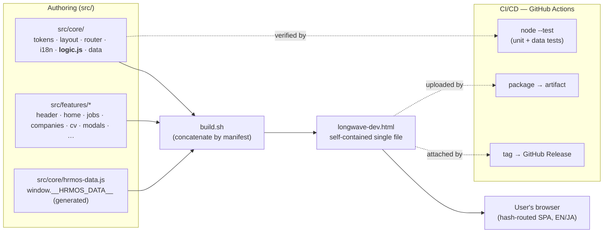
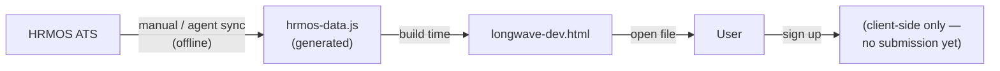
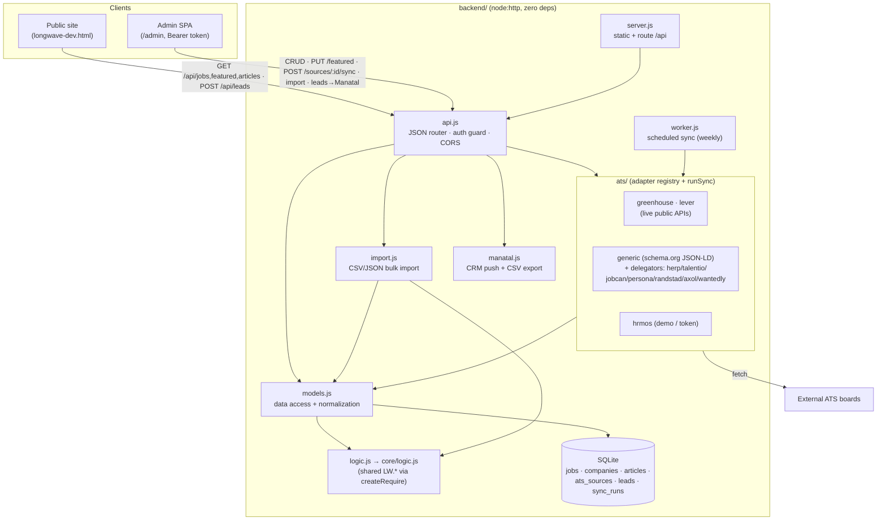
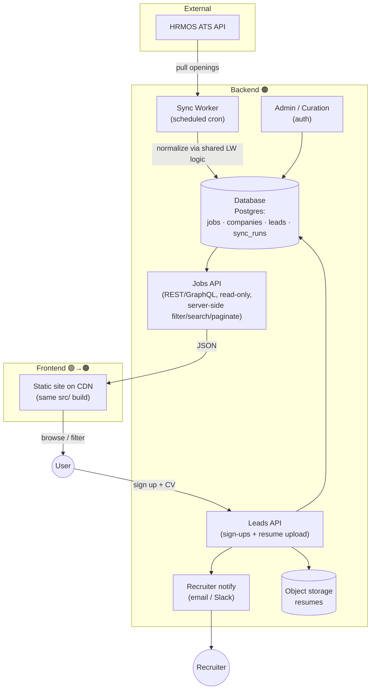
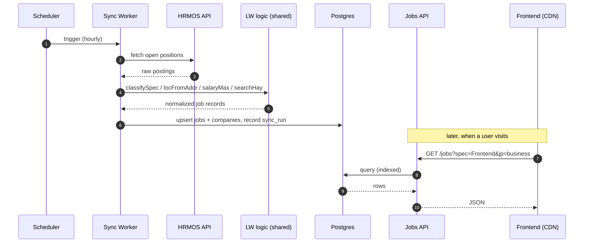
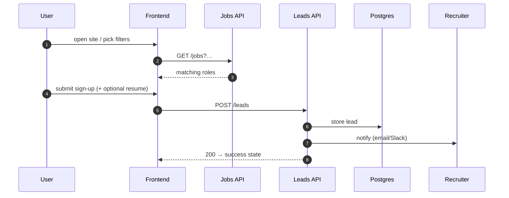
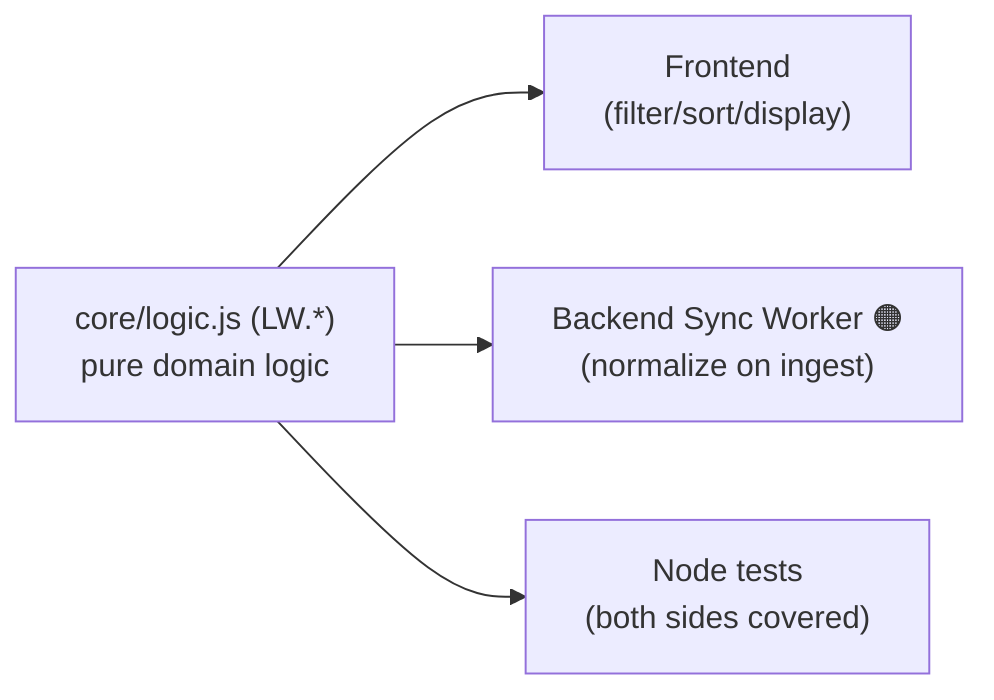

# LongWave Dev — Architecture

This document describes **(1) the architecture as it exists today** (a static,
single-file POC with no backend) and **(2) a proposed target architecture** for a
production build with a real frontend + backend. Diagrams are [Mermaid](https://mermaid.js.org/)
and render natively on GitHub.

> **Status legend** — 🟢 exists today · 🟠 proposed (not built yet).

---

## 1. Current architecture (POC) 🟢

The POC is a **single, self-contained `longwave-dev.html`** — all CSS, JS, web-font
links and the job data are inlined, so it runs by double-clicking the file. There is
**no server and no runtime data fetching**; the HRMOS job data is baked into the
bundle at build time.



### How the pieces fit

| Concern | Today |
| --- | --- |
| **UI** | Vanilla HTML/CSS/JS, no framework. One IIFE assembled from `src/` parts by `build.sh`. |
| **Routing** | Client-side hash router (`#/jobs`, `#/companies`, …) in `core/app.js`. |
| **i18n** | `core/i18n.js` — EN/JA dictionaries + `t()`; language toggled in the client. |
| **Domain logic** | `core/logic.js` (`LW.*`) — pure functions: specialty classification, address→prefecture, salary parsing, filter predicate, age calc. **No DOM, no state.** |
| **Data** | `core/hrmos-data.js` sets `window.__HRMOS_DATA__`, generated from an HRMOS sync and **embedded at build time**. Falls back to demo data in `core/data.js`. |
| **Forms** | Sign-up + CV builder are **client-only** today (sign-up shows a success state; the CV/rirekisho is generated and printed in-browser — no data leaves the page). |
| **Tests** | `test/` via Node's built-in `node:test` — unit tests for `LW.*` + integrity checks on the real data. Zero dependencies. |
| **CI/CD** | `.github/workflows/ci.yml` (test + bundle-freshness gate + artifact) and `release.yml` (tag → Release). |
| **Delivery** | Private repo → the built HTML ships as a CI **artifact** (per push) and a **Release asset** (per tag). No hosting. |

### Current data flow 🟢



**Key trait:** data is _static at build time_. Refreshing listings = re-running the
sync + rebuilding + redeploying. Good enough for a static POC; the backend below makes it live.

---

## 1b. Backend (as built) 🟢

A **runnable, zero-dependency** backend now lives in [`backend/`](../backend/README.md):
Node built-ins only — `node:http` (server), `node:sqlite` (`DatabaseSync`), global
`fetch` (ATS/Manatal). It serves a JSON API, an admin SPA, and the built public site,
and it **reuses this repo's `core/logic.js`** so the backend classifies jobs identically
to the frontend by construction.



| Concern | As built 🟢 |
| --- | --- |
| **Server** | `server.js` — `node:http`; serves `/api`, the `/admin` SPA (path-traversal-contained), and the built site at `/`. |
| **API** | `api.js` — public reads (`jobs/featured/articles`, `POST /leads`); everything else behind `Bearer ADMIN_TOKEN`. Malformed JSON → 400, empty leads → 400, hidden jobs never leak to anon. |
| **Data access** | `models.js` — upsert/list jobs, companies, articles, featured (gap-free ranks); normalizes spec/location through shared `LW`. SQLite via `db.js`. |
| **ATS** | `ats/` registry + `runSync`. Greenhouse/Lever pull live public JSON; others scrape schema.org `JobPosting` via `generic.js` (thin per-provider delegators share one `_delegate.js` factory). |
| **Import** | `import.js` — CSV/JSON portal exports, column-aliased (incl. Japanese), classified, deduped on `(source, source_ref)` namespaced per company. |
| **CRM** | `manatal.js` — push leads to Manatal (gated by `MANATAL_API_KEY`) or export CSV (formula-injection-safe). |
| **Scheduler** | `worker.js` — weekly per-source sync (`--once` for cron). |
| **Tests** | `backend/test/` via `node:test` — models, import, manatal branches, ATS detect/parse, and the HTTP layer (routing/auth/validation). |

### What's still 🟠 (productionizing)

SQLite → **Postgres**; single shared token → **real auth**; add **resume file storage**,
rate-limiting, a migrations framework; wire the **live HERP/HRMOS/Talentio APIs** (the
agency portals currently come in via the bulk-import path). The diagrams in §2 are the
target this is growing toward.

---

## 2. Target architecture (production) 🟠

Goal: **live listings**, **real sign-up/lead capture**, and an **admin path to
curate** roles — without throwing away what works (the pure domain logic and the
clean component split are reused).



### What changes vs. today

| Concern | Today 🟢 | Target 🟠 |
| --- | --- | --- |
| **Job data** | Embedded in the bundle at build time | Live from **Jobs API** (`GET /jobs?spec=&jp=&remote=&loc=&q=&page=`) backed by Postgres |
| **HRMOS refresh** | Manual sync + rebuild | **Sync Worker** on a schedule (e.g. hourly) writes to the DB; no rebuild needed |
| **Filtering/search** | All client-side over 593 embedded rows | Server-side (indexed) for scale; client keeps the instant-filter UX for the current page |
| **Sign-ups** | Client-only success state | **Leads API** persists the lead + resume to storage and notifies recruiters |
| **CV builder** | Client-only (stays!) | Unchanged — keep PII in the browser; only submit if the user opts in |
| **Hosting** | File / artifact | Static frontend on a **CDN**; backend on a small managed host or serverless |
| **Curation** | Edit data + rebuild | **Admin** UI to feature/hide/override roles (e.g. fix a misclassified spec) |

### Sequence — HRMOS → live listings 🟠



### Sequence — browse & sign-up 🟠



### The reuse that makes this clean

`core/logic.js` (`LW.*`) is **already pure and dependency-free**, and is already
`require()`-d by the Node tests. The **same module powers the Sync Worker's
normalization** (classify specialty, parse prefecture, parse salary, build the search
index) — so the frontend and backend agree on classification by construction, and it
stays unit-tested in one place.



---

## 3. Suggested tech choices 🟠

These are sensible defaults, not requirements — chosen for low ops + good DX.

| Layer | Suggestion | Why |
| --- | --- | --- |
| Frontend | Keep the static build, or migrate to **Astro / Next** if SSR/SEO is wanted | Current build is fast and zero-dep; a framework helps if pages grow or SEO/SSR matters |
| Jobs API | **Node + TypeScript** (Fastify/Hono) or serverless functions | Reuse `LW` logic directly (same language); small, read-mostly surface |
| DB | **Postgres** (+ built-in full-text search, or Meilisearch if needed) | Relational fit (jobs↔companies), good filtering/search |
| Sync Worker | Scheduled job (GitHub Actions cron, Cloud Run job, or a queue worker) | Decouples HRMOS refresh from deploys |
| Resume storage | Object storage (S3/R2) with signed uploads | Keep large/PII files out of the DB |
| Hosting | Frontend on a CDN (Cloudflare/Vercel/Netlify); API on a small managed host | Cheap, scalable, simple |
| Secrets | HRMOS token, DB URL, notify webhooks via the host's secret store | Never in the repo |

## 4. Migration path (POC → production) 🟠

1. **Extract the API contract** from today's data shape (`window.__HRMOS_DATA__`) — it
   already defines `jobs`, `companies`, `jobs_ja`, `blurb`. Make that the `GET /jobs`
   response shape so the frontend change is minimal.
2. **Stand up Postgres + the Sync Worker**, reusing `core/logic.js` for normalization.
3. **Add the Jobs API**; switch the frontend from `window.__HRMOS_DATA__` to a `fetch()`
   (keep the embedded data as an offline fallback).
4. **Add the Leads API** + resume storage; wire the existing sign-up modal to it.
5. **Host** the frontend on a CDN; deploy the backend; point the Sync Worker at HRMOS.
6. **Admin/curation** last, once listings are live.

## 5. Repository layout

Frontend source today lives under `src/` (see the [README](../README.md) for the full
map). If/when the backend is built, a clean split would be:

```
/                      ← frontend (current repo root: src/, build.sh, longwave-dev.html)
/backend/  🟠          ← api/ (Jobs + Leads API) · worker/ (HRMOS sync) · db/ (migrations)
/shared/   🟠          ← the LW domain logic, imported by both frontend build and backend
/docs/                 ← this file
```

> **Update:** the backend scaffold described in **[§1b](#1b-backend-as-built-)** now exists in
> **[`backend/`](../backend/README.md)** and already imports this repo's `core/logic.js` for
> normalization (the "shared logic" arrow above), so lifting that file into a dedicated
> `shared/` package is the only remaining step to fully formalize the split.
