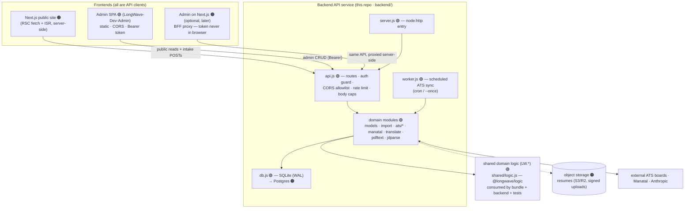
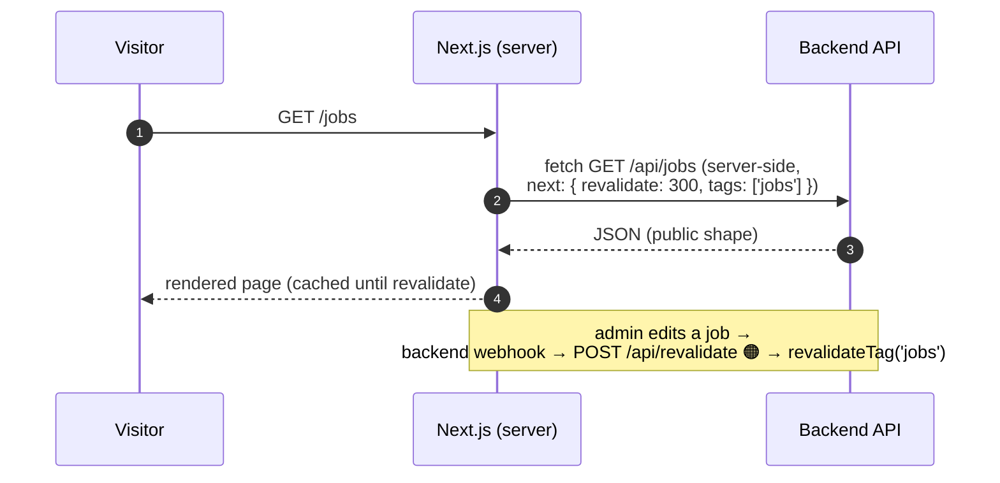
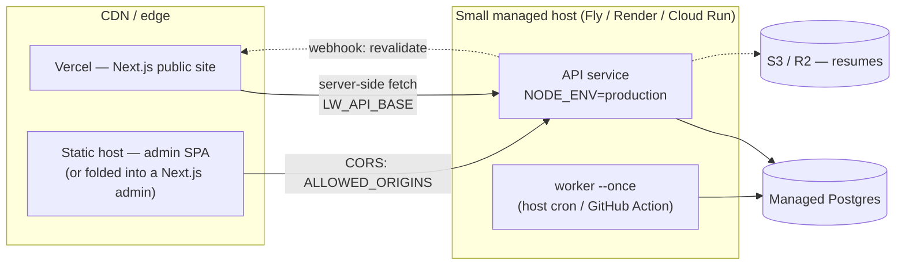

# LongWave Backend — Service Architecture (Next.js-ready)

This document defines the **backend as a standalone API service** and the target
architecture for pairing it with **Next.js** frontends. It is the backend-focused
companion to [`ARCHITECTURE.md`](./ARCHITECTURE.md) (whole-system view): that doc says
*what* the production system looks like; this one pins down the **service boundary, the
API contract frontends code against, and the order of work** to get there without
rewriting anything twice.

> **Status legend** — 🟢 exists today · 🟠 planned (not built yet).

---

## 0. Design stance

1. **The backend is a headless JSON API.** It renders no HTML that matters
   (the legacy single-file site it serves at `/` is a convenience, not a contract).
   Every frontend — today's static public site, the admin SPA
   ([LongWave-Dev-Admin](https://github.com/LongWave-Engineering/LongWave-Dev-Admin)),
   and a future Next.js site — is a **client of the same API**.
2. **Framework-agnostic contract, Next.js-idiomatic consumption.** Nothing in the API
   assumes Next.js; but the contract (stable JSON, public/admin split, cacheable public
   reads, explicit auth header) is exactly what Next.js Server Components, ISR, and
   Route Handlers consume cleanly. Adopting Next.js must require **zero backend route
   changes** — only additive work (pagination, revalidation webhook).
3. **Boundaries over rewrites.** The zero-dependency core (`node:http`, `node:sqlite`)
   stays until scale forces a change. The module boundaries below are drawn so the two
   known swaps — SQLite → Postgres, shared token → real auth — replace one layer each
   without moving any route.

---

## 1. Service boundary (target)

The load-bearing property: **there is exactly one write path per entity** (everything
funnels through `models.js`, which normalizes via shared `LW` logic), and **exactly one
auth gate** (`api.js`). Swapping the data layer or the auth scheme touches one module.

---

## 2. The API contract (what a Next.js app codes against)

Full route inventory lives in [`backend/README.md`](../backend/README.md#api-summary).
The shape that matters architecturally:

| Class | Routes | Auth | Cacheable |
| --- | --- | --- | --- |
| **Public reads** | `GET /api/jobs`, `/jobs/:id`, `/featured`, `/articles`, `/companies`, `/partners`, `/health` | none | ✅ — safe for ISR / CDN |
| **Public intake** | `POST /api/leads`, `POST /api/applications` | none (rate-limited per IP, body-capped) | ❌ |
| **Admin** | everything else (CRUD, import, sync, leads, stats) | `Authorization: Bearer $ADMIN_TOKEN` | ❌ |

### Contract conventions 🟢→🟠

- **Stability:** changes are **additive-only** (new fields, new endpoints). The first
  genuinely breaking change introduces `/api/v1/…` and both shapes are served through a
  deprecation window. Don't version pre-emptively — there is exactly one API consumer
  team; versioning buys nothing until a break is actually needed.
- **Errors:** non-2xx always carries `{ "error": "<message>" }`. 4xx = caller fault
  (malformed JSON → 400, oversized body → 413, missing/wrong token → 401, hidden/missing
  → 404), 5xx = server fault.
- **Anon redaction is a guarantee, not a habit:** hidden jobs 404 for anonymous callers,
  internal `tags` are stripped, ATS `token` is never serialized (only `hasToken`).
  Tests enforce all three; a Next.js public site can render API responses **verbatim**.
- **Pagination 🟢 (additive, opt-in):** `GET /api/jobs` returns a bare array by default
  (existing clients keep working). Passing `?page=` and/or `?per_page=` switches to the
  `{ items, total, page, per_page }` envelope — `total` spans the whole filtered set,
  `per_page` caps at 100, bad values fall back to defaults instead of erroring.
- **Typed contract 🟠:** author `docs/openapi.yaml` once the pagination shape lands; the
  Next.js repo generates TypeScript types from it (`openapi-typescript`) at build time.
  This is how the frontend gets end-to-end types **without** a monorepo or a shared
  runtime package.

---

## 3. Next.js integration patterns

### 3.1 Public site — Server Components + ISR 🟠

- **All job/article reads happen server-side** in Server Components. The API base comes
  from a **server-only env var** (`LW_API_BASE`) — it is never `NEXT_PUBLIC_*` unless a
  client component genuinely needs to fetch (none does today; keep it server-only and
  the API origin stays unexposed).
- **ISR over SSR:** listings change on sync/admin cadence (hours), not per-request.
  `revalidate` + tags gives CDN-speed pages with bounded staleness; an optional
  **revalidation webhook** (backend fires on admin writes / sync completion → a Next.js
  route handler calls `revalidateTag`) drops staleness to seconds. This webhook is the
  **only new backend endpoint Next.js adoption suggests**, and it's additive.
- **Job detail pages:** `generateStaticParams` from `GET /api/jobs`; a hidden job 404s
  from the API, which maps directly to Next's `notFound()`.
- **Intake (`POST /leads`, `/applications`):** proxy through a Next.js Route Handler
  rather than calling the API from the browser. The browser talks same-origin (no CORS
  surface at all for visitors), the API origin stays private, and bot defense
  (turnstile, honeypots) lives at the edge. Direct browser → API remains supported via
  the CORS allowlist for anything that prefers it.

### 3.2 Admin — today's SPA, and the optional Next.js path 🟠

- **Today 🟢:** the admin SPA calls the API cross-origin with a runtime-entered Bearer
  token. `ALLOWED_ORIGINS` (below) locks CORS to the admin's real origin.
- **If the admin moves to Next.js:** use the **BFF pattern** — a route-handler proxy
  (`/app/api/lw/[...path]/route.ts`) holds the admin token **server-side** (session
  cookie ↔ token), so the browser never sees it. That removes the token-in-localStorage
  caveat entirely. CORS becomes irrelevant on that path (same-origin), but the
  allowlist stays for the transition.
- **Auth evolution:** the single shared token is the scaffold. The target is per-user
  auth at the BFF (any OIDC provider), with the BFF exchanging its session for the
  backend Bearer server-side. The backend's auth surface — one header check in one
  place (`authed()` in `api.js`) — is deliberately small so this swap is one function.

### 3.3 What the backend guarantees every frontend

| Guarantee | Enforced by |
| --- | --- |
| Hidden jobs never leak to anon (list **or** by-id) | `api.js` + test |
| Internal `tags` stripped for anon | `stripInternalJob` + test |
| ATS credentials never serialized | `redactSource` + test |
| Public intake is rate-limited, body-capped, rejects malformed/empty | limiter + `readBody` + tests |
| UTF-8 (Japanese) bodies survive chunked transport | `readBody` byte-concat + test |
| Constant-time token comparison | SHA-256 + `timingSafeEqual` |
| Fail-closed boot: production refuses the default token | startup check in `api.js` |

---

## 4. Cross-cutting readiness checklist

In dependency order — each unblocks the ones after it:

| # | Item | Status | Shape of the work |
| --- | --- | --- | --- |
| 1 | **CORS origin allowlist** | 🟢 **done** | `ALLOWED_ORIGINS` env (comma-separated). Unset → `*` (dev). Set → matching `Origin` echoed back + `Vary: Origin`; non-matching origins get **no** CORS grant. |
| 2 | **Shared logic → own package** | 🟢 **done** | `shared/logic.js` (`@longwave/logic`) at the repo root — outside the frontend tree, consumed by the bundle, the backend, and the tests via path imports. The backend no longer reaches into `src/`. |
| 3 | **Pagination on `/api/jobs`** | 🟢 **done** | Additive opt-in envelope (§2) — landed before any Next.js code exists, so no frontend ever binds to the unbounded array. |
| 4 | **OpenAPI + generated TS types** | 🟠 | `docs/openapi.yaml` after #3; Next.js repo generates types at build. |
| 5 | **Revalidation webhook** | 🟠 | Backend POSTs to `$REVALIDATE_URL` (with a shared secret) after admin writes / sync runs; Next.js route handler calls `revalidateTag`. Fire-and-forget, additive. |
| 6 | **Postgres + migrations framework** | 🟠 | `db.js` is the only module that touches SQLite; swap driver behind the same `all/get/run/transaction` helpers. Replace `ensureColumn` with numbered migrations at the same time. |
| 7 | **Resume object storage** | 🟠 | Signed uploads to S3/R2; `leads` keeps a pointer, PII files stay out of the DB. |
| 8 | **Real auth** | 🟠 | Per-user OIDC at the admin BFF (§3.2); backend keeps one bearer check. |
| 9 | **Edge rate limiting / caching** | 🟠 | Move the best-effort in-memory limiter's job to the CDN/edge in front of the API; add `Cache-Control` to public reads when a CDN fronts them. |
| 10 | **Observability** | 🟠 | Structured request log line (status, ms, route) + `/api/health` (exists) split into liveness/readiness once Postgres arrives. |

---

## 5. Deployment topology (target) 🟠

**Environment (the whole config surface):** `PORT`, `DB_PATH` (→ `DATABASE_URL` 🟠),
`ADMIN_TOKEN` (fail-closed in production), `ALLOWED_ORIGINS`, `MANATAL_API_KEY`,
`HRMOS_API_TOKEN`, `ANTHROPIC_API_KEY` + `TRANSLATE_MODEL`/`JD_MODEL`,
`RATE_LIMIT_MAX`/`RATE_LIMIT_WINDOW_MS`, `TRUST_PROXY`, body caps. No dotenv loader —
use the host's secret store, or `node --env-file=.env` locally.

---

## 6. Phased plan

Each phase ships alone; nothing blocks on a big-bang.

1. **Phase 0 — contract hardening (this commit).** CORS allowlist; this document.
2. **Phase 1 — formalize the contract.** Shared-logic package (#2), pagination (#3),
   OpenAPI + types (#4). After this, a Next.js app can be built against a typed,
   stable, independently-deployable API.
3. **Phase 2 — Next.js public site.** New repo (`LongWave-Dev-Web`), Server Components
   + ISR per §3.1, intake proxied at the edge, revalidation webhook (#5). The current
   static build keeps shipping until parity, then the CDN flips.
4. **Phase 3 — production data layer.** Postgres + migrations (#6), resume storage
   (#7), edge limits/caching (#9), observability (#10).
5. **Phase 4 — admin evolution (optional).** Admin on Next.js with the BFF proxy and
   per-user auth (#8). The admin SPA works unchanged until/unless this is wanted.

## 7. Where the repos land

Follow the precedent LongWave-Dev-Admin set — **one app, one repo**, talking to this
API over its contract:

| Repo | Contents |
| --- | --- |
| `longwave-jobs-poc` (this) | Backend API + worker (+ the legacy static site until Phase 2 completes). Long-term this repo *becomes* the backend repo. |
| `LongWave-Dev-Admin` 🟢 | Admin SPA (unchanged). |
| `LongWave-Dev-Web` 🟠 | The Next.js public site (Phase 2). Generates its API types from this repo's OpenAPI spec. |

A monorepo was considered and rejected for now: the deploy targets, cadences, and
access models of the three apps already differ, and the API contract (not shared
source) is the interface. Revisit only if type-generation friction proves real.
